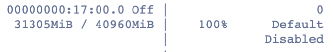
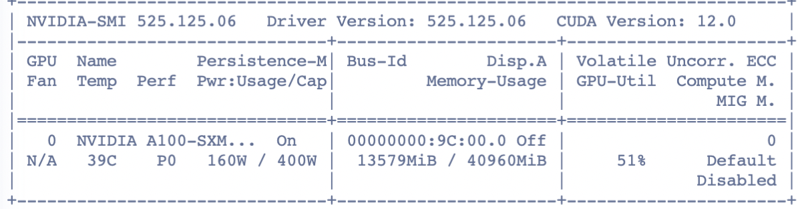

# Lora
这是lora训练模型的参考代码

# 1. Lora + EAE
## 1.1 EAE Base
EAE基于传统深度模型训练信息，3次：
- 1次
start trainning....
0:20:26.492532
0.5300 0.3287 0.4058
0 0.40578887627695803
0:20:12.634644
0.4798 0.4156 **0.4454**
1 0.4454299088445429
0:20:13.617798
0.4598 0.4313 0.4451
2 0.44507710557532615
0:20:13.064541
0.4797 0.4028 0.4379
3 0.437890527368158
0:20:14.251547
0.4769 0.3982 0.4340
4 0.43397644700576293
0:20:12.369265
0.4677 0.3922 0.4266
5 0.4266066516629158
0:20:13.156849
0.4762 0.3821 0.4240
6 0.4239795918367347
0:20:14.201914
0.4306 0.3834 0.4056
7 0.4056420233463035
0:20:13.312576
0.4954 0.3706 0.4240
8 0.42398737506575485
0:20:13.825360
0.4558 0.3655 0.4057
9 0.405715743812197
- 2
start trainning....
0:20:29.832050
0.5354 0.3545 0.4266
0 0.42655601659751036
0:20:13.152587
0.5314 0.3733 **0.4386**
1 0.43856332703213613
0:20:13.760264
0.5148 0.3669 0.4285
2 0.4284563758389262
0:20:14.204501
0.4670 0.3770 0.4172
3 0.4171966420758077
0:20:14.008638
0.4741 0.4083 0.4387
4 0.4387351778656126
0:20:13.888507
0.4778 0.3664 0.4148
5 0.4147801196981524
0:20:14.164572
0.4563 0.3959 0.4239
6 0.4239290989660266
0:20:14.524841
0.4246 0.3793 0.4007
7 0.4006799417192812
0:20:13.334480
0.4839 0.3720 0.4206
8 0.4205874707564336
0:20:14.480783
0.4554 0.3802 0.4144
9 0.41443247306439485

- 3次
start trainning....
0:20:19.720377
0.5502 0.3549 0.4315
0 0.43152599217439913
0:20:12.268257
0.5177 0.3770 0.4363
1 0.4362862463421122
0:20:13.849715
0.5390 0.3779 **0.4443**
2 0.44432432432432434
0:20:12.846842
0.4874 0.4014 0.4402
3 0.44024205748865364
0:20:13.900681
0.4625 0.3968 0.4271
4 0.427121999505073
0:20:12.829938
0.4753 0.3756 0.4196
5 0.4196199280945044
0:20:13.648574
0.4789 0.3701 0.4175
6 0.4175311203319502

## 1.2 EAE model with lora
如何设置 Target modules for applying PEFT / LoRA on different models

https://stackoverflow.com/questions/76768226/target-modules-for-applying-peft-lora-on-different-models

figure中也有：modules_to_save

```
DataParallel(
  (module): Bert(
    (model): BertModel(
      (embeddings): BertEmbeddings(
        (word_embeddings): Embedding(30522, 768, padding_idx=0)
        (position_embeddings): Embedding(512, 768)
        (token_type_embeddings): Embedding(2, 768)
        (LayerNorm): LayerNorm((768,), eps=1e-12, elementwise_affine=True)
        (dropout): Dropout(p=0.1, inplace=False)
      )
      (encoder): BertEncoder(
        (layer): ModuleList(
          (0-11): 12 x BertLayer(
            (attention): BertAttention(
              (self): BertSelfAttention(
                (query): Linear(in_features=768, out_features=768, bias=True)
                (key): Linear(in_features=768, out_features=768, bias=True)
                (value): Linear(in_features=768, out_features=768, bias=True)
                (dropout): Dropout(p=0.1, inplace=False)
              )
              (output): BertSelfOutput(
                (dense): Linear(in_features=768, out_features=768, bias=True)
                (LayerNorm): LayerNorm((768,), eps=1e-12, elementwise_affine=True)
                (dropout): Dropout(p=0.1, inplace=False)
              )
            )
            (intermediate): BertIntermediate(
              (dense): Linear(in_features=768, out_features=3072, bias=True)
              (intermediate_act_fn): GELUActivation()
            )
            (output): BertOutput(
              (dense): Linear(in_features=3072, out_features=768, bias=True)
              (LayerNorm): LayerNorm((768,), eps=1e-12, elementwise_affine=True)
              (dropout): Dropout(p=0.1, inplace=False)
            )
          )
        )
      )
      (pooler): BertPooler(
        (dense): Linear(in_features=768, out_features=768, bias=True)
        (activation): Tanh()
      )
    )
    (dropout): Dropout(p=0.5, inplace=False)
    (linear_1): Linear(in_features=768, out_features=1, bias=True)
    (linear_2): Linear(in_features=768, out_features=1, bias=True)
  )
)
```

```
from peft import LoraConfig, get_peft_model
config = LoraConfig(
    r=16,
    lora_alpha=16,
    target_modules=["query", "value"],
    lora_dropout=0.1,
    bias="none",
)


for _ in range(0,2):
    print('-----------------------------------------------------')
    loss_func = torch.nn.CrossEntropyLoss()
    model = Bert()
    model = torch.nn.DataParallel(model, device_ids=[0])
    model = model.cuda()
    model = get_peft_model(model, config)
    model.print_trainable_parameters()


===================================BUG REPORT===================================
Welcome to bitsandbytes. For bug reports, please run

python -m bitsandbytes

 and submit this information together with your error trace to: https://github.com/TimDettmers/bitsandbytes/issues
================================================================================
bin /root/paddlejob/workspace/env_run/log/test_result/py38/lib/python3.8/site-packages/bitsandbytes/libbitsandbytes_cuda110.so
CUDA SETUP: CUDA runtime path found: /usr/local/cuda/lib64/libcudart.so
CUDA SETUP: Highest compute capability among GPUs detected: 8.0
CUDA SETUP: Detected CUDA version 110
CUDA SETUP: Loading binary /root/paddlejob/workspace/env_run/log/test_result/py38/lib/python3.8/site-packages/bitsandbytes/libbitsandbytes_cuda110.so...
trainable params: 589,824 || all params: 110,073,602 || trainable%: 0.5358
```


## 1.3 问题 BUG REPORT：
```
===================================BUG REPORT===================================
Welcome to bitsandbytes. For bug reports, please submit your error trace to: https://github.com/TimDettmers/bitsandbytes/issues
================================================================================
CUDA_SETUP: 。。。
```
解决参考：

https://powervision.feishu.cn/wiki/DUMbwl0MmiNeA6ksElqcWIzxnqg

https://stackoverflow.com/questions/75918140/getting-runtimeerror-expected-scalar-type-half-but-found-float-in-aws-p3-instan

【未解决，但是不影响】

## 1.4 结果对比

base结果




| version | r | model_size | time | f1 | 内存 |
|-------|-------|-------|-------|-------|-------| 
| base | - | 438M | 0:20:13 | 44.5 |  |
| v1 | 16 | 419M | 0:18:13 | 32.59 |  |
| v2 | 8 | 419M | 0:18:13 | 40.53 | 31953 | 
| v3 | 4 | 419M | 0:18:13 |  | 31947 |


模型保存：

```
torch.save(model.module.state_dict(), './model/static_dict' + str(epoch) + '_' + str(f1) + '.pkl')
```

lora代码：

```
from peft import LoraConfig, get_peft_model
config = LoraConfig(
    r=16,
    lora_alpha=16, // 类似于学习率，
    target_modules=["query", "value"],
    lora_dropout=0.1,
    bias="none",
)


for _ in range(0,2):
    print('-----------------------------------------------------')
    loss_func = torch.nn.CrossEntropyLoss()
    model = Bert()
    model = torch.nn.DataParallel(model, device_ids=[0])
    model = model.cuda()
    model = get_peft_model(model, config)
    model.print_trainable_parameters()
```

- r=16
start trainning....
0:18:22.908965
0.0000 0.0000 0.0000
0 0
0:18:12.739460
0.1066 0.0060 0.0113
1 0.01131911188506748
0:18:13.745912
0.1909 0.1182 0.1460
2 0.1459812553251917
0:18:13.670358
0.2679 0.0483 0.0818
3 0.08180755746007012
0:18:12.874326
0.3434 0.1205 0.1784
4 0.17835262083049694
0:18:13.618615
0.3651 0.1936 0.2530
5 0.25300480769230765
0:18:12.692408
0.4004 0.1894 0.2572
6 0.2571785268414482
0:18:13.659559
0.3787 0.2584 0.3072
7 0.30718775621754574
0:18:12.896181
0.4388 0.2474 0.3164
8 0.31637753601881796
0:18:13.608401
0.4829 0.2460 0.3259
9 0.32592141334145597


- r=8
start trainning....
0:18:19.993699
0.0000 0.0000 0.0000
0 0
0:18:12.723799
0.1364 0.0014 0.0027
1 0.0027309968138370506
0:18:13.616844
0.1860 0.0037 0.0072
2 0.007213706041478809
0:18:13.321274
0.2694 0.0814 0.1250
3 0.12499999999999999
0:18:12.407801
0.3517 0.1494 0.2097
4 0.2097450790577606
0:18:13.448253
0.3577 0.2138 0.2676
5 0.2676258992805755
0:18:12.244776
0.3961 0.2244 0.2865
6 0.2864690343410625
0:18:13.353111
0.3927 0.2464 0.3028
7 0.3028248587570621
0:18:12.360423
0.3856 0.2713 0.3185
8 0.31848852901484487
0:18:13.486323
0.3986 0.2892 0.3352
9 0.33519850786037836
0:18:13.336562
0.4448 0.2777 0.3419
10 0.34191904896688363
0:18:12.277188
0.4499 0.3016 0.3611
11 0.3611340489953207
0:18:13.273844
0.4405 0.3080 0.3626
12 0.3625541125541126
0:18:12.450623
0.4352 0.3163 0.3663
13 0.3663471778487753
0:18:13.217966
0.4343 0.3329 0.3769
14 0.3768870380010411
0:18:12.553327
0.4804 0.3094 0.3764
15 0.37639821029082776
0:18:14.245163
0.4610 0.3421 0.3927
16 0.3927157561361837
0:18:13.518567
0.4838 0.3301 0.3925
17 0.3924569554523093
0:18:12.235732
0.4924 0.3444 **0.4053**
18 0.40530303030303033
0:18:13.184117
0.5053 0.3274 0.3973
19 0.3973214285714286


# 2. chatglm_v2 + EAE

[https://github.com/yuanzhoulvpi2017/zero_nlp/tree/main/simple_thu_chatglm6b](https://github.com/yuanzhoulvpi2017/zero_nlp/tree/main/chatglm_v2_6b_lora)

https://github.com/THUDM/ChatGLM2-6B

## 2.1 基础测试代码
```
from transformers import AutoTokenizer, AutoModel
tokenizer = AutoTokenizer.from_pretrained("chatglm2-6b", trust_remote_code=True)
model = AutoModel.from_pretrained("chatglm2-6b", trust_remote_code=True, device='cuda')
model = model.eval()
response, history = model.chat(tokenizer, "你好", history=[])
print(response)
# 你好👋!我是人工智能助手 ChatGLM2-6B,很高兴见到你,欢迎问我任何问题。
response, history = model.chat(tokenizer, "晚上睡不着应该怎么办", history=history)
print(response)

'''
晚上睡不着可能会让你感到焦虑或不舒服,但以下是一些可以帮助你入睡的方法:

1. 制定规律的睡眠时间表:保持规律的睡眠时间表可以帮助你建立健康的睡眠习惯,使你更容易入睡。尽量在每天的相同时间上床,并在同一时间起床。
2. 创造一个舒适的睡眠环境:确保睡眠环境舒适,安静,黑暗且温度适宜。可以使用舒适的床上用品,并保持房间通风。
3. 放松身心:在睡前做些放松的活动,例如泡个热水澡,听些轻柔的音乐,阅读一些有趣的书籍等,有助于缓解紧张和焦虑,使你更容易入睡。
4. 避免饮用含有咖啡因的饮料:咖啡因是一种刺激性物质,会影响你的睡眠质量。尽量避免在睡前饮用含有咖啡因的饮料,例如咖啡,茶和可乐。
5. 避免在床上做与睡眠无关的事情:在床上做些与睡眠无关的事情,例如看电影,玩游戏或工作等,可能会干扰你的睡眠。
6. 尝试呼吸技巧:深呼吸是一种放松技巧,可以帮助你缓解紧张和焦虑,使你更容易入睡。试着慢慢吸气,保持几秒钟,然后缓慢呼气。

如果这些方法无法帮助你入睡,你可以考虑咨询医生或睡眠专家,寻求进一步的建议。
'''
```


## 2.2 代码简单解读

### 2.2.1 读取命令行参数

HfArgumentParser 是Hugging Face库为方便用于解析命令行参数而提供的工具
 
```
    parser = HfArgumentParser(
        (ModelArguments, DataTrainingArguments, Seq2SeqTrainingArguments))
    if len(sys.argv) == 2 and sys.argv[1].endswith(".json"):
        # If we pass only one argument to the script and it's the path to a json file,
        # let's parse it to get our arguments.
        model_args, data_args, training_args = parser.parse_json_file(
            json_file=os.path.abspath(sys.argv[1]))
    else:
        model_args, data_args, training_args = parser.parse_args_into_dataclasses()
```

比如继续解析数据集：

```
    data_files = {}
    if data_args.train_file is not None:
        data_files["train"] = data_args.train_file
        extension = data_args.train_file.split(".")[-1]
    if data_args.validation_file is not None:
        data_files["validation"] = data_args.validation_file
        extension = data_args.validation_file.split(".")[-1]
    if data_args.test_file is not None:
        data_files["test"] = data_args.test_file
        extension = data_args.test_file.split(".")[-1]
```

比如继续解析模型：

```
    config = AutoConfig.from_pretrained(
        model_args.model_name_or_path, trust_remote_code=True)
    config.pre_seq_len = model_args.pre_seq_len
    config.prefix_projection = model_args.prefix_projection

    tokenizer = AutoTokenizer.from_pretrained(
        model_args.model_name_or_path, trust_remote_code=True)
```

### 2.2.2 lora训练的核心代码

```
    elif model_args.lora_r is not None:
        from peft import LoraConfig, get_peft_model
        LORA_R = model_args.lora_r
        LORA_ALPHA = 16
        LORA_DROPOUT = 0.05
        TARGET_MODULES = [
            "query_key_value",
        ]

        config = LoraConfig(
            r=LORA_R,
            lora_alpha=LORA_ALPHA,
            target_modules=TARGET_MODULES,
            lora_dropout=LORA_DROPOUT,
            bias="none",
            task_type="CAUSAL_LM",
        )
        model = model.to(torch.bfloat16)
        model = get_peft_model(model, config)
        model.print_trainable_parameters()
```

### 2.2.3 处理数据格式：

```
def preprocess_function_eval()

def preprocess_function_train()
```

### 2.2.4 训练数据处理，加载到train_dataset中。

```
    if training_args.do_train:
        if "train" not in raw_datasets:
            raise ValueError("--do_train requires a train dataset")
        train_dataset = raw_datasets["train"]
        if data_args.max_train_samples is not None:
            max_train_samples = min(
                len(train_dataset), data_args.max_train_samples)
            train_dataset = train_dataset.select(range(max_train_samples))
        with training_args.main_process_first(desc="train dataset map pre-processing"):
            train_dataset = train_dataset.map(
                preprocess_function_train,
                batched=True,
                num_proc=data_args.preprocessing_num_workers,
                remove_columns=column_names,
                load_from_cache_file=not data_args.overwrite_cache,
                desc="Running tokenizer on train dataset",
            )
        print_dataset_example(train_dataset[0])
```

### 2.2.5 初始化训练器

训练器详情见 train.py 和 train_seq2seq.py

```
    trainer = Seq2SeqTrainer(
        model=model,
        args=training_args,
        train_dataset=train_dataset if training_args.do_train else None,
        eval_dataset=eval_dataset if training_args.do_eval else None,
        tokenizer=tokenizer,
        data_collator=data_collator,
        compute_metrics=compute_metrics if training_args.predict_with_generate else None,
        save_changed=model_args.pre_seq_len is not None,
        save_lora_model=True if model_args.lora_r is not None else False
    )
```

### 2.2.6 训练

```
    # Training
    if training_args.do_train:
        checkpoint = None
        if training_args.resume_from_checkpoint is not None:
            checkpoint = training_args.resume_from_checkpoint
        # elif last_checkpoint is not None:
        #     checkpoint = last_checkpoint
        model.gradient_checkpointing_enable()
        model.enable_input_require_grads()
        train_result = trainer.train(resume_from_checkpoint=checkpoint)
        # trainer.save_model()  # Saves the tokenizer too for easy upload

        metrics = train_result.metrics
        max_train_samples = (
            data_args.max_train_samples if data_args.max_train_samples is not None else len(
                train_dataset)
        )
        metrics["train_samples"] = min(max_train_samples, len(train_dataset))

        trainer.log_metrics("train", metrics)
        trainer.save_metrics("train", metrics)
        trainer.save_state()
```


## 2.3 模型训练

注意Transformer的版本：

https://github.com/THUDM/ChatGLM2-6B/blob/main/requirements.txt



结果：

```
[INFO|configuration_utils.py:667] 2024-10-20 18:49:40,613 >> loading configuration file /root/paddlejob/workspace/env_run/chatglm/10.25.73.162:8011/data1/models/chatglm2-6b/config.json
[INFO|configuration_utils.py:725] 2024-10-20 18:49:40,614 >> Model config ChatGLMConfig {
  "_name_or_path": "THUDM/chatglm2-6b",
  "add_bias_linear": false,
  "add_qkv_bias": true,
  "apply_query_key_layer_scaling": true,
  "apply_residual_connection_post_layernorm": false,
  "architectures": [
    "ChatGLMModel"
  ],
  "attention_dropout": 0.0,
  "attention_softmax_in_fp32": true,
  "auto_map": {
    "AutoConfig": "configuration_chatglm.ChatGLMConfig",
    "AutoModel": "modeling_chatglm.ChatGLMForConditionalGeneration",
    "AutoModelForCausalLM": "modeling_chatglm.ChatGLMForConditionalGeneration",
    "AutoModelForSeq2SeqLM": "modeling_chatglm.ChatGLMForConditionalGeneration",
    "AutoModelForSequenceClassification": "modeling_chatglm.ChatGLMForSequenceClassification"
  },
  "bias_dropout_fusion": true,
  "classifier_dropout": null,
  "eos_token_id": 2,
  "ffn_hidden_size": 13696,
  "fp32_residual_connection": false,
  "hidden_dropout": 0.0,
  "hidden_size": 4096,
  "kv_channels": 128,
  "layernorm_epsilon": 1e-05,
  "model_type": "chatglm",
  "multi_query_attention": true,
  "multi_query_group_num": 2,
  "num_attention_heads": 32,
  "num_layers": 28,
  "original_rope": true,
  "pad_token_id": 0,
  "padded_vocab_size": 65024,
  "post_layer_norm": true,
  "pre_seq_len": null,
  "prefix_projection": false,
  "quantization_bit": 0,
  "rmsnorm": true,
  "seq_length": 32768,
  "tie_word_embeddings": false,
  "torch_dtype": "float16",
  "transformers_version": "4.30.2",
  "use_cache": true,
  "vocab_size": 65024
}

{'loss': 3.2905, 'learning_rate': 6.000000000000001e-07, 'epoch': 0.41}                                                               
{'loss': 3.3185, 'learning_rate': 5.333333333333335e-07, 'epoch': 0.41}                                                               
{'loss': 3.2616, 'learning_rate': 4.666666666666667e-07, 'epoch': 0.41}                                                               
{'loss': 3.3123, 'learning_rate': 4.0000000000000003e-07, 'epoch': 0.41}                                                              
{'loss': 3.3397, 'learning_rate': 3.3333333333333335e-07, 'epoch': 0.41}                                                              
{'loss': 3.3605, 'learning_rate': 2.666666666666667e-07, 'epoch': 0.41}                                                               
{'loss': 3.2385, 'learning_rate': 2.0000000000000002e-07, 'epoch': 0.41}                                                              
{'loss': 3.3093, 'learning_rate': 1.3333333333333336e-07, 'epoch': 0.42}                                                              
{'loss': 3.2732, 'learning_rate': 6.666666666666668e-08, 'epoch': 0.42}                                                               
{'loss': 3.2388, 'learning_rate': 0.0, 'epoch': 0.42}                                                                                 
100%|███████████████████████████████████████████████████████████████████████████████████████████| 3000/3000 [2:11:00<00:00,  2.70s/it][INFO|configuration_utils.py:667] 2024-10-20 18:54:12,225 >> loading configuration file /root/paddlejob/workspace/env_run/chatglm/10.25.73.162:8011/data1/models/chatglm2-6b/config.json
[INFO|configuration_utils.py:725] 2024-10-20 18:54:12,226 >> Model config ChatGLMConfig {
  "_name_or_path": "THUDM/chatglm2-6b",
  "add_bias_linear": false,
  "add_qkv_bias": true,
  "apply_query_key_layer_scaling": true,
  "apply_residual_connection_post_layernorm": false,
  "architectures": [
    "ChatGLMModel"
  ],
  "attention_dropout": 0.0,
  "attention_softmax_in_fp32": true,
  "auto_map": {
    "AutoConfig": "configuration_chatglm.ChatGLMConfig",
    "AutoModel": "modeling_chatglm.ChatGLMForConditionalGeneration",
    "AutoModelForCausalLM": "modeling_chatglm.ChatGLMForConditionalGeneration",
    "AutoModelForSeq2SeqLM": "modeling_chatglm.ChatGLMForConditionalGeneration",
    "AutoModelForSequenceClassification": "modeling_chatglm.ChatGLMForSequenceClassification"
  },
  "bias_dropout_fusion": true,
  "classifier_dropout": null,
  "eos_token_id": 2,
  "ffn_hidden_size": 13696,
  "fp32_residual_connection": false,
  "hidden_dropout": 0.0,
  "hidden_size": 4096,
  "kv_channels": 128,
  "layernorm_epsilon": 1e-05,
  "model_type": "chatglm",
  "multi_query_attention": true,
  "multi_query_group_num": 2,
  "num_attention_heads": 32,
  "num_layers": 28,
  "original_rope": true,
  "pad_token_id": 0,
  "padded_vocab_size": 65024,
  "post_layer_norm": true,
  "pre_seq_len": null,
  "prefix_projection": false,
  "quantization_bit": 0,
  "rmsnorm": true,
  "seq_length": 32768,
  "tie_word_embeddings": false,
  "torch_dtype": "float16",
  "transformers_version": "4.30.2",
  "use_cache": true,
  "vocab_size": 65024
}

[INFO|trainer.py:2053] 2024-10-20 18:54:12,370 >> 

Training completed. Do not forget to share your model on huggingface.co/models =)


{'train_runtime': 7861.039, 'train_samples_per_second': 6.106, 'train_steps_per_second': 0.382, 'train_loss': 3.4439417317708334, 'epoch': 0.42}
100%|███████████████████████████████████████████████████████████████████████████████████████████| 3000/3000 [2:11:01<00:00,  2.62s/it]
***** train metrics *****
  epoch                    =       0.42
  train_loss               =     3.4439
  train_runtime            = 2:11:01.03
  train_samples            =     114599
  train_samples_per_second =      6.106
  train_steps_per_second   =      0.382
```

## 2.4 训练的一些信息

6B模型原始大小：12G

保存大小：90M

## 2.5 测试

原始结果

```
from transformers import AutoTokenizer, AutoModel
tokenizer = AutoTokenizer.from_pretrained("", trust_remote_code=True)
model = AutoModel.from_pretrained("chatglm2-6b", trust_remote_code=True, device='cuda')
model = model.eval()
response, history = model.chat(tokenizer, "类型#上衣*材质#牛仔布*颜色#白色*风格#简约*图案#刺绣*衣样式#外套*衣款式#破洞", history=[])

print(response)
上衣款式 简约刺绣款式的牛仔布外套，颜色为白色，材质为牛仔布。这款外套在风格上表现为简约，图案为刺绣。
```
